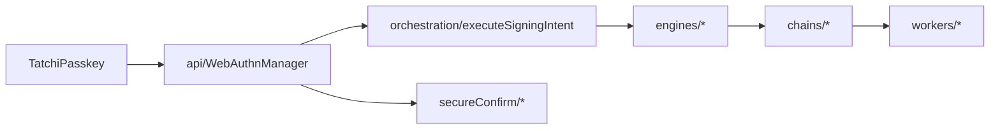
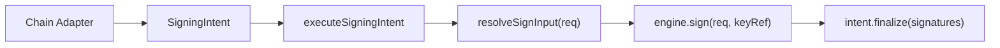
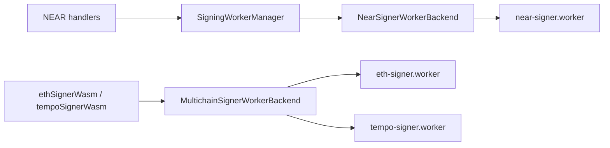

# Signing Architecture (`client/src/core/signing`)

This folder is the signing runtime for NEAR + Tempo/EVM flows.

## Top-Level Roles

- `api/`
  - Public orchestration entrypoint (`WebAuthnManager`).
  - Coordinates session policy, worker context, SecureConfirm, and engine dispatch.
- `orchestration/`
  - Shared signing contracts (`SigningIntent`, `SignRequest`, `SigningEngine`) and generic runner (`executeSigningIntent`).
- `engines/`
  - Algorithm-specific signing implementations (`ed25519`, `secp256k1`, `webauthnP256`).
- `chains/`
  - Chain-specific intent builders and handlers (NEAR, Tempo, EVM helpers).
- `secureConfirm/`
  - User confirmation flow + WebAuthn credential collection.
- `workers/`
  - Worker transports:
  - `signingWorkerManager`: unified worker architecture layer.
  - `signingWorkerManager/backends/nearWorkerBackend`: NEAR signer worker backend.
  - `signingWorkerManager/backends/multichainWorkerBackend`: EVM/Tempo worker backend.
- `threshold/`
  - Threshold session, authorization, and signing workflows.
- `webauthn/`
  - Passkey prompt and credential serialization helpers.

## Module Call Graph (Compact)

### 1) High-level map

### 2) Signing execution pipeline

### 3) Worker backends

## Core Flows

### 1) NEAR Signing (`transactionsWithActions`, `delegate`, `NEP-413`)

1. `WebAuthnManager` creates a NEAR ed25519 sign request and calls `executeSigningIntent`.
2. `NearEd25519Engine` routes by request kind to NEAR handlers.
3. Handler performs:
   - input normalization (`NearAdapter` for transactions),
   - SecureConfirm handshake (`SecureConfirmWorkerManager.confirmAndPrepareSigningSession`),
   - signer worker call via `ctx.sendMessage(...)`.
4. `SigningWorkerManager.sendMessage` sends request to `near-signer.worker`.
5. Worker response returns signed payload back through handler -> engine -> `finalize`.

### 2) Tempo Signing (`eip1559` / `tempoTransaction`)

1. `WebAuthnManager.signTempo` imports:
   - `signTempoWithSecureConfirm`,
   - `Secp256k1Engine`,
   - `WebAuthnP256Engine`.
2. `TempoAdapter.buildIntent` computes signing digest/challenge using:
   - `ethSignerWasm` (EIP-1559 hash/encoding),
   - `tempoSignerWasm` (Tempo sender hash/encoding).
3. `signTempoWithSecureConfirm` runs SecureConfirm once for intent approval.
4. `executeSigningIntent` dispatches to:
   - `secp256k1` engine (local or threshold ECDSA path), or
   - `webauthnP256` engine (serialized credential or browser WebAuthn call).
5. Adapter `finalize` returns encoded raw tx hex.

### 3) secp256k1 Threshold Path (inside `Secp256k1Engine`)

1. Validate cached/session JWT and threshold key ref.
2. Authorize digest with relayer (`thresholdEcdsaAuthorize`).
3. Dispense PRF.first from SecureConfirm session cache.
4. Derive client share in `ethSignerWasm`.
5. Run distributed signing coordination (`thresholdEcdsaCoordinator`).
6. Return 65-byte recoverable secp256k1 signature.

### 4) Worker RPC Path (`ethSigner` / `tempoSigner`)

1. Chain wasm wrapper (`ethSignerWasm` or `tempoSignerWasm`) calls `executeMultichainWorkerOperation(...)`.
2. That helper dispatches to `getMultichainSignerWorkerBackend(kind).requestOperation(...)`.
3. `MultichainSignerWorkerBackend` lazily creates a dedicated module worker by kind.
4. Request/response is correlated by message `id`.
5. Returned `ArrayBuffer` is decoded to `Uint8Array` in caller.

## Practical Rule of Thumb

- `WebAuthnManager` owns product-level orchestration.
- `orchestration/` owns the generic signing execution contract.
- `engines/` own algorithm-level signing behavior.
- `chains/` own chain-specific intent shape and final serialization.
- `workers/` own runtime transport to WASM worker backends.
