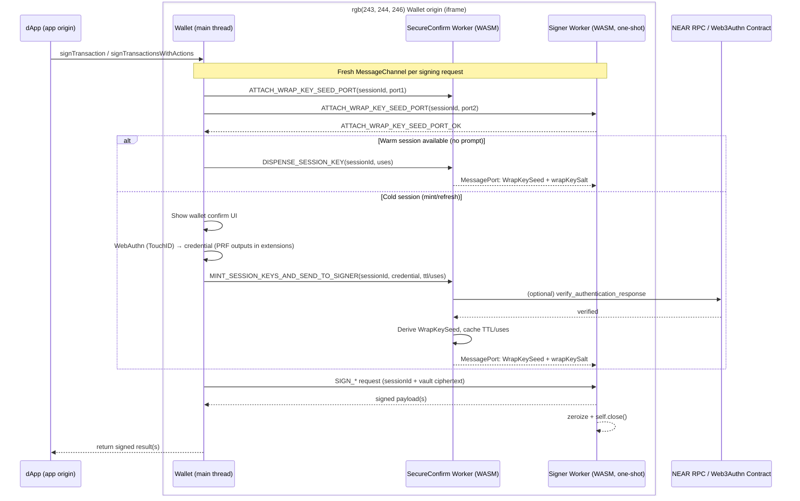

# SecureConfirm Sessions

SecureConfirm sessions turn the SecureConfirm‑WebAuthn unlock into a short‑lived **session capability**: the user approves once (TouchID/WebAuthn), then the wallet can sign multiple actions for a limited window without re‑prompting.

Instead of keeping decrypted keys around, the wallet caches only the *minimum capability* needed to unwrap the vault inside workers:

- **SecureConfirm worker (WASM)** keeps `{WrapKeySeed, wrapKeySalt}` + policy (`ttl_ms`, `remaining_uses`) in memory.
- **Signer workers (WASM)** remain **one‑shot**; each request gets key material over a fresh `MessageChannel`, signs, then terminates.

## Why sessions exist

Running a full SecureConfirm challenge + WebAuthn assertion for every local signing request adds latency with no extra security when the PRF output never leaves the device. Sessions keep the SecureConfirm‑WebAuthn handshake as a **mint-once capability**:

- Unlock once with TouchID/WebAuthn, then sign multiple actions for a short time or usage budget.
- Reserve per-transaction SecureConfirm checks for remote attestation or high-risk actions.

## Security properties

- **Freshness + replay resistance**: SecureConfirm challenges are unique; proofs bind the session to a fresh challenge.
- **Block binding**: Challenges can include recent block height/hash to prevent stale-session reuse.
- **User presence**: WebAuthn assertion proves touch/biometric presence over the exact SecureConfirm challenge.
- **Policy enforcement**: The worker enforces TTL and usage caps encoded in the challenge or local defaults.
- **Auditability**: Session minting can be logged with challenge digest + block height without exposing secrets.

## Two layers of “session”

**1) SecureConfirm‑owned session (capability)**
- Stored in the SecureConfirm worker’s memory and keyed by `sessionId`.
- Contains `WrapKeySeed` bytes and `wrapKeySalt` plus TTL/usage budget.
- Enforced in the SecureConfirm worker (expire/exhaust → refuse to dispense).

**2) Per‑request signing handshake**
- For each signing request, the wallet creates a fresh `MessageChannel`.
- One port is transferred to the SecureConfirm worker and one port to a new signer worker.
- SecureConfirm sends `{WrapKeySeed, wrapKeySalt}` *only over that port*; it is never put into a main‑thread JS payload.


## Flow (cold vs warm)

### Cold path: mint/refresh a SecureConfirm session (requires WebAuthn)

1. Create a fresh `MessageChannel` and attach ports to SecureConfirm + signer workers for `sessionId`.
2. Run the normal SecureConfirm‑WebAuthn confirmation flow (confirm UI + TouchID/WebAuthn → credential with PRF outputs in `clientExtensionResults`).
3. SecureConfirm worker derives `WrapKeySeed` (from `PRF.first_auth` + in‑memory `secureconfirm_sk`) and stores `{WrapKeySeed, wrapKeySalt}` with TTL/uses in a SecureConfirm‑owned session.
4. SecureConfirm worker sends `{WrapKeySeed, wrapKeySalt}` to the signer worker over the attached port; signer stores it.
5. Main thread sends the signing request; if the seed hasn’t arrived yet the signer waits internally, then decrypts, signs, and terminates.

### Warm path: reuse a SecureConfirm session (no WebAuthn prompt)

1. Create a fresh `MessageChannel` and a new signer worker for the same `sessionId`.
2. Call `DISPENSE_SESSION_KEY(sessionId)` in the SecureConfirm worker:
   - SecureConfirm enforces TTL/remaining‑uses
   - If valid, SecureConfirm sends `{WrapKeySeed, wrapKeySalt}` over the attached port and closes it
3. Main thread sends the signing request; signer waits internally for the seed if needed, then signs and terminates.
4. If the session is missing/expired/exhausted, fall back to the cold path to re‑mint.

## Enabling warm signing sessions

Warm signing sessions are **opt-in** and controlled by `signingSessionDefaults` (global) or `signingSession` (per login call).

- When `ttlMs: 0` or `remainingUses: 0`, warm signing is effectively disabled (a TouchID/WebAuthn prompt is required for each signing operation).
- Warm sessions are **in-memory only** (cleared on page refresh/close).

### Configure defaults

```ts
import { PASSKEY_MANAGER_DEFAULT_CONFIGS } from '@tatchi-xyz/sdk/react';

const config = {
  ...PASSKEY_MANAGER_DEFAULT_CONFIGS,
  signingSessionDefaults: {
    ttlMs: 5 * 60 * 1000,
    remainingUses: 3,
  },
};
```

### Override per login

```ts
await tatchi.loginAndCreateSession('alice.testnet', {
  signingSession: { ttlMs: 10 * 60 * 1000, remainingUses: 10 },
});
```

### Inspect session status

`loginAndCreateSession()` returns a `signingSession` status object when available:

```ts
const login = await tatchi.loginAndCreateSession('alice.testnet');
console.log(login.signingSession); // { status: 'active' | 'expired' | ... }
```


## Session handshake diagram




::: info Security properties
- `WrapKeySeed` never enters main‑thread JS; it is transferred worker‑to‑worker over a `MessagePort`.
- The signer worker is one‑shot and holds no cross‑request state; session enforcement lives in the SecureConfirm worker.
- Warm signing is only possible if the SecureConfirm worker has a valid (unexpired, unexhausted) session capability.
:::

## Operational invariants

- SecureConfirm worker never handles `near_sk` or vault material; only `{WrapKeySeed, wrapKeySalt}` crosses workers.
- PRF outputs and session secrets never touch the main thread or dApp payloads.
- All prompts originate from the SecureConfirm worker flows; signer worker never calls SecureConfirm.
